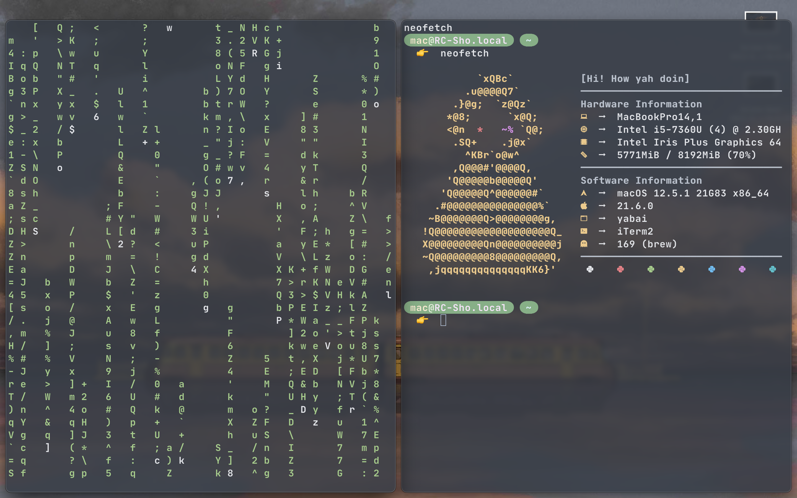

# Sho-dot-file
Yah! This is my dotfile you can refer this

### Hi my name's Sho and this is my dotfiles.
All of thing i use is my laptop
1. **zsh** of course
2. **yabai & skhd** to manager window tiling
3. **Neovim** Great! I just custom a little bit from [Astronvim](https://astronvim.github.io/)
4. **neofetch** :smile:

### My screen shot here 👇

### How to use it?

**If you like that, please Star my repo 🌟**

**And if you want to support let follows my github 🎆**

--------------------------------------------------------------
***Authorized by Sho0***
